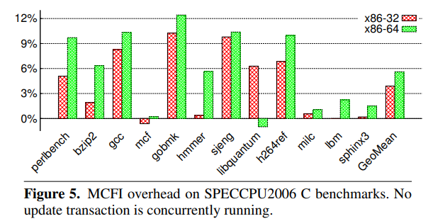

# [MCFI \[Niu+ PLDI'14\]](https://dl.acm.org/doi/10.1145/2594291.2594295)
- 目的
    - 分割コンパイル(主に動的リンク)を扱えるCFIの作成
- 既存手法の問題点
    - 既存手法はCFGを静的に計算するため，動的リンクをうまく扱えない
    - そのため，分割コンパイルされたプログラムにCFIを(効率よく)適用できない
- 提案手法
    - 各モジュールにメタデータを持たせ，リンク時にCFGを動的に構築・更新することで，分割コンパイルに対応する
- 結果
    - 実行時間 : 平均+7% (動的リンクの頻度が毎秒50回と仮定)
    - コード量 : 平均+17%
    - メモリ使用量 : 無視できる程度の増加
    - 防御力
        - ROP-gadget攻撃の95.75%を防げる
        - 飛び先の候補を保護なしに比べて99.99%減らせる

# 背景知識
## CFIとは
- CFI : Control Flow Integrity
- control-flow hijackingなどの制御フローを不正に操作する攻撃からプログラムを守る手段の一つ

基本的な手順 (この手順に沿わないCFIもある) :
1. 実行前に，保護対象のControl-Flow Graph (CFG) を求める
2. 実行時に，プログラムがそのCFGに沿って動いているかチェックする
    - indirect jmp/call, return命令の遷移先をチェックする

## クラシカルなCFIの手順
1. Indirect Branch Target (IBT) の集合を Equivalence Class (EC) に分割
2. 各ECに一意の番号 Equivalence-Class Number (ECN) を振る
3. ECNをもとにIBTを実行時にチェックするためのコードを計装する

### 1. IBTの集合をECに分割
ECの満たすべき性質 :
- indirect branch (ibranch) が指しうるtargetは全て同じECに属する
- ECは共通部分を持たない
    - この性質が原因でprecisionが下がる (後述)

<note>
(indirect branch) = (indirect jmp) + (indirect call) + (return)
</note>

#### 例 (ここではindirect callに着目)
`rand`の中身までは解析で追わないものとする

<div class="slider-001">
    <div class="slide-001"><div class="slide-content-001"></div></div>
    <div class="slide-001"><div class="slide-content-001"></div></div>
    <div class="slide-001"><div class="slide-content-001"></div></div>
    <div class="slide-001"><div class="slide-content-001"></div></div>
    <div class="slide-001"><div class="slide-content-001"></div></div>
</div>

### 2. 各ECに一意の番号ECNを割り振る
用語の定義 :
- **Address ECN**
    - ibranch命令の飛び先になりうるアドレスについて，そのアドレスが属するECの番号
- **Branch ECN**
    - ibranch命令について，その飛び先として許されるECの番号
- **Target ECN**
    - ibranch命令について，実行時の実際の飛び先が属するECの番号



### 3. ECNをもとにIBTを動的にチェックするコードを計装
- branch ECNとtarget ECNが一致しない場合のみ，不正な実行とみなす



<question>

`p()`で`baz`が呼ばれた場合，このCFIで検知できるか？
<details>
<summary>Ans.</summary>
できない．
</details>
</question>


#### 計装コードの例
次の`ret`を計装する．
```x86asm
    ...
    ; `retaddr`へ飛ぶと仮定
    ret

retaddr:
    ...
```

これは次のように計装される．
```x86asm
    ...
    ; 戻り先をrcxに退避
    popq %rcx

    ; 実際は，ECNに適当な即値が埋め込まれる
    ; branch ECN　[$ECN] と target ECN [4(%rcx)] が異なるなら，エラー
    cmpl $ECN, 4(%rcx)
    jne  error

    ; branch ECN と target ECN が同じなら，`retaddr`へジャンプ
    jmpq *%rcx

retaddr:
    ; 副作用のない形でretaddrの address ECN を埋め込む
    ; 副作用がなければ，`prefetchnta`命令でなくても良い（はず）
    prefetchnta ECN
    ...
```

## クラシカルなCFIの欠点
動的リンクに対応できない．

### 動的リンクがない場合 @ indirect call
次のような保護がなされていた．


### 動的リンクがある場合 @ indirect call
- `FN_FOO`と`FN_BAR`のaddress ECNについて :
    - `a.out`は同じにしたい
    - `b.out`は同じにしたくない
    - ECNはコードセクション（書き込み不可）に埋め込まれる
- `b.out`に合わせると，`a.out`で`FN_BAR`への`call`が違法判定されてしまう (FP)
- → `a.out`に合わせる必要があるが，そうすると`b.out`のCFIの精度が落ちる
- いかなるプログラムに対してもFPを出してはならないので，CFIの防御力が著しく下がる



<note>

クラシカルなCFIでの対処法 :
- 各ソフトウェアが，それ専用の計装が施された共有ライブラリを使う
    - 「専用」なので共有できない
    - 共有ライブラリの「共有できる」という利点がなくなってしまう

</note>

# MCFIの概要
MCFIの目的 : 分割コンパイルされ，かつマルチスレッドで動くアプリに対応したCFIの提案

## Threat model
### 攻撃者のモデル : concurrent attacker model
攻撃者は，
- アプリのスレッドとconcurrentに動くスレッドから攻撃する
- アプリの任意の2命令の間にメモリ操作ができる
    - ただし， memory page protection の範囲で
- レジスタを直接操作することはできない
    - ただし，レジスタに読まれるメモリを操作することで，間接的に操作することはできる

### その他
- メモリがwritableかつexecutableにならない
    - 任意コード実行を防ぐ目的
    - (MCFIの独自ランタイムを作る際に，これが保証されるよう気をつける)

## MCFIの方針
- 各モジュールにCFGを計算するための情報(auxiliary information)を持たせる
- 静的リンク時には，独自の静的リンカで各モジュールの情報を結合する
- 動的リンク時には，独自の動的リンカでその情報を用いてCFGを更新する
- ECNにバージョンの概念を加えた「ID」を「IDテーブル」で管理する
    - IDテーブルはBaryとTaryの2種類ある

イメージ図 (実際の実装とは異なる．auxiliary info.は省略．)


## Challenge
### マルチスレッド下で，安全・効率的にCFGを更新できるか
CFGの更新中に，別スレッドでibranchのチェックが必要になることがある (逆も同様)

MCFIの手法 :
- CFGをコード領域とは別の領域に作る
- CFGの更新にトランザクションを用いる

### モジュールのリンク時に高いprecisionで新たなCFGを作れるか
MCFIの手法 :
- 関数と関数ポインタの型情報を各モジュールに持たせ，それを元にCFGを構築する

# 提案手法の詳細
## IDのフォーマット
- ID = ECN + バージョン番号
- CFIが動的に更新されるたび，バージョン番号を上げる
- 4Byte長 (atomicに操作できる)
- 各ByteのLSBが下から順に(1,0,0,0)のとき，そのIDは有効(valid)とみなす

```
            ECN                       Version
/                          \ /                         \
+---------+---+---------+---+---------+---+---------+---+
|         : 0 |         : 0 |         : 0 |         : 1 |
+---------+---+---------+---+---------+---+---------+---+
        Higher 2 Bytes            Lower 2 Bytes         ↑ 4-byte aligned
```

## 用語
Address ID, Branch ID, Target IDは，ECNと同様に定義する．

<question>
各IDの使われ方を説明してください．
<details>
<summary>Ans.</summary>

- Address ID
    - ibranch命令の飛び先になりうるアドレスについて，そのアドレスが属するID
- Branch ID
    - ibranchが飛ぶことを許されるID
- Target ID
    - 実行時にibranchの飛び先が属するID
</details>
</question>


## IDテーブルについて
2つのテーブルがある :
- Target ID table (Tary table)
    - `Map<飛び先アドレス, AddressID>`
    - ibranchの飛び先アドレスを用いて，それが属するIDを引く
- Branch ID table (Bary table)
    - ibranchのアドレスから，それのbranch IDを引く
    - `Map<ibranchのアドレス, BranchID>`

<note>

便宜上`Map`と書いたが，アドレスからIDを引ければデータ構造は何でも良い．<br>
(実際には配列が使われる)

</note>

### Taryテーブルの構造
- `Map<飛び先アドレス, AddressID>`
- IDの配列として表現
- targetになり得ないアドレスに対応するエントリはゼロ埋め

#### テーブルを小さくするための工夫
- IDは4Byte長なので，全アドレス分のエントリを用意するとコード領域の4倍のサイズが必要

- 工夫 : nopを挿入して全ての飛び先を4バイト境界に配置
    - Tary tableのエントリ数は1/4に削減される
- 4バイト境界に無いアドレスでテーブルが引かれるのを検知するために，valid IDの概念を使う
    - 例えばtargetが4バイト境界でないアドレスに不正操作された場合，Tary tableを引いた時点で攻撃を検知できる．

### Baryテーブルの構造
- `Map<ibranchのアドレス, BranchID>`
- branch IDの配列として表現
- 一度ロードされたら，その命令のアドレスは変化しない．
- そこで，モジュールをロードするときにBaryテーブルの固定のインデックスを埋め込む
- → Taryテーブルと異なり，無効なエントリは存在しないので，サイズは最小限

## IDテーブルの保護 @x86_64
- IDテーブルは実行時に動的に更新される (後述)
- → テーブルを攻撃者から保護する必要がある

保護の方法
- IDテーブルは，アドレス空間[4GB, 8GB)に置く
- プログラム中のメモリwriteについて，[0, 4GB)の範囲しか書き込めないよう計装する

<note>
mallocでたまたまアドレス空間[4GB, 8GB)からメモリが確保されたらどうするのかは不明．
</note>

### イメージ図 (再掲)


### IDテーブルをコード領域から分離する利点
- 従来のCFIはECNをコードに埋め込んでいた
- MCFIはそれをコード領域から分離した

利点 :
- ECNが，プロセス固有のID tablesによってパラメタ化される
    - 共有ライブラリのcode領域はECNを持たないので，プロセス間でライブラリを共有できる
    - (共有ライブラリに関するIDとして，プロセスごとに異なる値を使うことができる)

<note>
従来のCFIでは，共有ライブラリを使うプロセスごとに専用の計装をしなければならず，プロセス間で同じライブラリを共有できなかった．
</note>

## IDテーブルの読み取りと更新
- IDテーブル(CFG)の更新中に，別スレッドでibranchのチェックが起こりうる (逆も然り)
    - チェック機構が更新中の表を参照するのはNG
- トランザクションを行うことで予期せぬ動作を防ぐ

1. Update transaction : `TxUpdate`
    - 動的リンク時 (表の更新時) に実行される
    - リンク後の新たなCFGに沿った，新たなIDでテーブルを更新する
2. Check transaction : `TxCheck`
    - ibranchの前に実行される
    - ibranchのあるアドレスと，飛び先のアドレスを元に，branch ID と target IDをテーブルから読んで比較する
    - テーブルには読みアクセスしかしない

### Update transaction
前提 : 次の関数があるとする．
- `getBaryECN(IbranchOpAddr) -> BranchECN`
    - branchの飛び先として許される（新たな）ECの番号を返す
    - 対応するECNが無い場合は負値を返す
- `getTaryECN(TargetAddr) -> ECN`
    - branchの飛び先になりうる箇所のアドレスについて，それが属す（新たな）ECの番号を返す
    - 対応するECNがない場合は負値を返す

<note>
負値を返す → IDとして負値を使えなくなるので実際の実装はこれとは違う可能性あり．
</note>

```c
void TxUpdate() {
    // - 複数のスレッドで同時に動的リンクが起きても問題ないようロックを取る
    // - 動的リンクは稀なので，排他制御してもオーバーヘッドは実用上問題ない
    // - ロック取得中でもTxCheckは実行できる
    acquire(updLock);
    globalVersion += 1;

    // テーブルの更新はインターリーブさせてはならない
    // もしインターリーブすると
    // - TaryとBaryの両方において，古いIDと新しいIDが混在する状態が生まれる
    // - TxCheckにおいて，異なるibranchに対してバージョンの違うテーブルでの検査がおこる
    updTaryTable();
    sfence;
    updBaryTable();

    release(updLock);
}

void updTaryTable() {
    // テーブルを確保し，初期化(ゼロ埋め)
    // （恐らく）古いCFGの情報がないと新しいCFGを構築できないので，
    // CFGを直接弄るのではなくnewTblを確保する．
    allocateAndInit(newTbl);

    for (addr = codeBase; addr < CodeLimit; addr += 4) {
        // ecnには，addrの新しいtargetECNが入る
        ecn = getTaryECN(addr);
        if (ecn >= 0) {
            entry = (addr - CodeBase) / 4;
            newTbl[entry] = 0x1; // init reserved bits
            setECNAndVer(newTbl, entry, ecn, globalVersion);
        }
    }

    // 各エントリのコピーはアトミックになるように実装する
    copyTaryTable(newTbl, TaryTableBase);

    free(newTbl);
}
```

### Check transactions
- return, indirect jump, indirect call で実装が異なる

returnの場合 :
```x86asm
TxCheck {
    ; 戻り先をレジスタに退避．
    ; チェック中に戻り先が不正操作された場合の影響をなくす
    popq %rcx
    ; %rcxの上位32bitをゼロ埋め
    ; これにより，飛び先は [0, 4GB)の範囲に制限される
    movl %ecx, %ecx
Try:
    ; Baryテーブルを引いて，結果（branch ID）を%ediに (これは常に valid ID)
    movl %gs:ConstBaryIndex, %edi
    ; Taryテーブルを引いて，結果(target ID)を%esiに (これは invalid IDになりうる)
    movl %gs:(%rcx), %esi
    cmpl %edi, %esi
    jne  Check
    jmpq *%rcx

; - target ID が invalid IDの場合
; - target IDとbranch IDのバージョンが違う場合
Check:
    ; %silは%esiのLSB．invalid IDの検知をしている．
    testb $1, %sil
    jz    Halt
    ; バージョンが違う場合は初めからやり直し．
    cmpw  %di, %si
    jne   Try
Halt:
    hlt
}
```
<!-- $ // 自前のlatex用の前処理がバグっているのでその対処-->

# Module Linking
MCFIは，動的にCFGを計算するために，各モジュールに関数・関数ポインタの型をもたせる

<note>
モジュールに何をもたせるかには，precisionとefficiencyのトレードオフがある．
</note>

## Type-matching CFG generation
C言語のみを考える．

ibranchは次のように分類できる
- indirect call
- indirect jmp
    - (intra-procedural) 関数内でjmpするもの
    - (inter-procedural) 違う関数へとjmpするもの
- return

### `T*`型の関数ポインタ由来のindirect call
次の条件を両方満たすものを，ibranchの合法な飛び先とみなす．
- オペランドとしてコード中に現れる
- 飛び先の関数の型`S`が，`T`と構造的に等しい(structurally equivalent)．
    - e.g. `struct A {int a; int b}`と`struct B {int c; int d}`を区別しない
    - これを厳格に当てはめると，合法なtargetが見落とされうるので適当な前処理をする (後述)

### intra-proceduralなindirect jump
- switch文やindirect goto文をコンパイルする際に使われる
- 飛び先は，ハードコードされた読み専用のジャンプテーブルから構成される
- 静的に解析できる

### inter-proceduralなindirect jump
- indirect tail callに使われる（→末尾呼び出し最適化）
- 飛び先の関数の型が，呼ばれるべき関数の型と構造的に等しい(structurally equivalent) ときだけ許可

### return命令
- 合法な飛び先（戻り先）を得るためにcall graphを作成
- direct/indirect call, tail callを考慮して，健全な（合法なエッジの見落としがない）CFGを構築

### その他
- `longjmp`
    - `set jmp`callで飛び先が決定される
    - 対応する`set jmp`を（静的解析で）見つけることで対処
- シグナルハンドラ
    - シグナルハンドラはアプリのコードにreturnしない
    - 代わりに，`sigreturn`システムコールを呼ぶ，小さなcode snippetへとreturnする
    - code snippetをインライン化することで，この問題に対応した
- 可変長引数を持つ関数
    - `T* = int (*)(int, ...)`のとき，返り値と第1引数がintな関数は全部許可
- インラインasm
    - インラインasm中の関数ポインタと関数には手でアノテーションを付ける


### CFGを作る上での前提条件
入力のCプログラムは以下を満たすよう事前処理しておく．

- **(C1) 関数ポインタへの/からのキャストが明示・暗黙を問わずない**
    - 関数ポインタ型を持つunionによって起こるキャストも禁止
    - 関数ポインタを含むstructへのキャストも禁止
- **(C2) インラインアセンブリが無い**
    - 使いたい場合は適切にアノテーションを付ける

<!-- <note>関数ポインタ「から」のキャストは許して良い気がする</note> -->

#### C1に抵触するが，例外的に許すもの
- Upcast (UC)
    - C言語で継承や多態性を表現するときに使われる
- Safe downcast (DC)
    - C言語で継承や多態性を表現するときに使われる
    - downcastは一般に非安全だが，注意深く書いてあれば問題ない
- Malloc and free (MF)
    - (`malloc`/`free`)では`void*`(からの/への)キャストが必要
- Safe update (SU)
    - 関数ポインタに即値を代入する場合
        - 整数型からポインタへのキャストが生じる
        - 例 : ポインタに`NULL`を代入する場合
- Non-function-pointer access (SU)
    - キャストはするが，関数ポインタに関係ない部分のみが使われる場合
        - 例 : `if (((A*)(b->c))->d) {...}`

#### その他の例外
**(K1) 関数ポインタが，互換性のない関数を指すポインタで初期化される場合**

例 : 互換性のない関数をもたせることで多態性を表現
- `long`型の要素を持つSetを考える
    - 要素を比較する関数を指す関数ポインタの型は`int (*)(long, long)`
- このHasSetを，文字列`char*`型のHashSetとして使いたい
    - 要素を比較する関数として，型の異なる`strcmp`をセットする

問題点 :
- 関数ポインタとそれが指す関数の型が異なるので，MCFIのCFIでは誤検知(FP)される

対処 :
- ラッパを書いて型を一致させる
```c
int wrap_strcmp(long a, long b) {
    return strcmp((char*)a, (char*)b);
}
```

**(K2) 関数ポインタが一度別の型にキャストされた後，元の型に再度キャストされる**
- indirect call時には適切な型に戻っているので，手を加える必要なし

#### C1/C2に抵触する部分についての表
|SPECCPU2006 | SLOC    | VBE  | UC  | DC  | MF  | SU  | NF  | VAE | K1 | K1-fixed | K2  |
|:-----------|--------:|-----:|----:|----:|----:|----:|----:|----:|---:|---------:|----:|
|perlbench   | 126,345 | 2878 | 510 | 957 | 234 | 633 | 318 | 226 | 4  | 4        | 222 |
|bzip2       | 5,731   | 27   | 0   | 0   | 6   | 4   | 0   | 17  | 0  | 0        | 17  |
|gcc         | 235,884 | 822  | 0   | 0   | 15  | 737 | 27  | 43  | 36 | 22       | 7   |
|mcf         | 1,574   | 0    | 0   | 0   | 0   | 0   | 0   | 0   | -  | -        | -   |
|gobmk       | 157,649 | 0    | 0   | 0   | 0   | 0   | 0   | 0   | -  | -        | -   |
|hmmer       | 20,658  | 20   | 0   | 0   | 20  | 0   | 0   | 0   | -  | -        | -   |
|sjeng       | 10,544  | 0    | 0   | 0   | 0   | 0   | 0   | 0   | -  | -        | -   |
|libquantum  | 2,606   | 1    | 0   | 0   | 0   | 0   | 0   | 1   | 1  | 1        | 0   |
|h264ref     | 36,098  | 8    | 0   | 0   | 8   | 0   | 0   | 0   | -  | -        | -   |
|milc        | 9,575   | 8    | 0   | 0   | 3   | 0   | 0   | 5   | 0  | 0        | 5   |
|lbm         | 904     | 0    | 0   | 0   | 0   | 0   | 0   | 0   | -  | -        | -   |
|sphinx3     | 13,128  | 12   | 0   | 0   | 11  | 1   | 0   | 0   | -  | -        | -   |

- VBE : UC, DCなどのfalse-positiveを処理する前のC1,C2の違反数
- VAE : UC, DCなどを除外(K1, K2は処理前)したあとのC1, C2の違反数
- gccのK1-fixedに含まれない14箇所は，dead-codeなどの理由で修正を要さなかった

# 評価
調べたいこと :
- オーバーヘッド
- 作られるCFGの精度
- 防御力

検体 :
- SPECCPU2006 C benchmarks

## 時間オーバーヘッド
次の2種類を考える．
- チェック用コードなどの計装に由来するもの
- 動的リンク時の解析・排他制御に由来するもの

### 計装による時間オーバーヘッド

- ライブラリは全て静的リンクして計測
- 横軸 : 検体
- 縦軸 : 実行時間の計装による増加割合

### CFGの動的構築による時間オーバーヘッド
- 動的リンクは稀にしか起きないという仮定を置けば，オーバーヘッドは大きくないだろう (推測)
- 動的リンクが頻繁に起こるJIT環境を想定したテストをおこなった
    - 50Hzで人為的にIDテーブルの更新を起こした
    - <note>50HzはJITを行うJSエンジンを計測した結果を元にした値</note>


- 横軸 : 検体
- 縦軸 : 実行時間の計装・CFGの動的構築による増加割合

### 空間・コード量のオーバーヘッド
- 実行ファイル・オブジェクトのサイズは平均+17%
- メモリ使用量のオーバーヘッドは，ソフトウェアが確保するheapの大きさに比べれば無視できる程度

### IDテーブルの読み取り・更新の速度
トランザクションの実装には様々な手法があるが，MCFIの戦略は良いものであった

|                    |MCFI|TML |Readers Writer Lock|Mutex|
|:-------------------|:--:|:--:|:-----------------:|:---:|
|Normalized Exec Time|1   |2   |29                 |22   |

## 作られるCFGの精度 @x86-64
|SPEC 2006 | IBs  | IBTs  | EQCs |
|:---------|-----:|------:|-----:|
|perlbench | 2081 | 15273 | 737  |
|bzip2     | 217  | 544   | 93   |
|gcc       | 4796 | 46943 | 1991 |
|mcf       | 174  | 445   | 106  |
|gobmk     | 2487 | 10667 | 579  |
|hmmer     | 715  | 4369  | 353  |
|sjeng     | 337  | 1435  | 184  |
|libquantum| 258  | 702   | 121  |
|h264ref   | 1096 | 3604  | 432  |
|milc      | 432  | 2356  | 264  |
|lbm       | 161  | 426   | 96   |
|sphinx3   | 589  | 2895  | 321  |

- IBs : 計装したibranchの数
- IBTs : ibranchのtargetになりうる場所の数
- EQCs : 作られたECの数
    - 上限は min(IBs, IBTs)で，それに近いほど良い
- coarse-graind CFIよりは2,3桁ほど精度が良い

<note>

- fine-graind CFI
    - CFGを元に計算され，各ibranchごとに，飛び先として許されるECを持つことができる
        - 2つのibranchの指し先が全く同じこともある
- coarse-graind CFI
    - fine-graind に比べ，一つのECがより多くのibranchに共有される
    - 例 : 飛び先のアドレスが特定の範囲なら許す

</note>

## 防御力
### ROP gadget攻撃の観点から
- ツール(rp++)を用いて ROP-gadgetを調べた
- x86-32/64 において，96.93%/95.75%のROP-gadgetが保護された

### AIRの観点から
|手法  |分割コンパイル|実行時間      |AIR(※2) |
|:----:|:------------:|:-------------|:--------|
|MCFI  |対応          | 平均7%(※1)  |99.99%   |
|binCFI|非対応        | 平均5%       |98.91%   |
|NaCl  |非対応        | 平均5%       |96.15%   |

- (※1) : 計装由来のオーバーヘッドが平均4～6%, IDテーブルの更新を含めると平均6～7%
- (※2) : Average Indirect-target Reduction [(ソース)](https://www.usenix.org/system/files/conference/usenixsecurity13/sec13-paper_zhang.pdf)
    - 許される飛び先がどれだけ減ったかを表す指標
    - $S$: 保護なしでibranchの飛び先になれるアドレスの数
    - $|T_j|$: 保護ありで$j$番目のibranchの飛び先になれるアドレスの数
    - $$\dfrac{1}{n}\sum_{j=1}^n \left( 1 - \dfrac{|T_j|}{S} \right)$$

# 結論
- 分割コンパイル(静的リンク・動的リンク)を扱えるCFIを提案した
- MCFIにより計装されたibranchは，CFGを表す2つの表を元にチェックされる
- 動的リンク時には，それら表がMCFIのランタイムにより更新される
- スレッド安全性を持たせるため，表の操作はトランザクション処理される


<!-- 概要，o背景知識，o問題設定，o提案手法，o実装，o実験，関連研究，結論および自分の研究との関連 -->
