# Define sound analysis

## Steps
1. Make assumptions for soundness
2. Define sound static analysis (in math form)
3. Check soundness
4. Implement the analysis (pseudo code)

## Make assumptions for soundness
#### $\mathbb{S^\sharp}$ is CPO
We assume an abstract domain $\mathbb{S}^\sharp$ is CPO.

> **Def. CPO (complete partial order)**
>
> A partial order $E$ is CPO when $E$ satisfies:
> - $E$ has infimum (bottom) and,
> - Any totally ordered subset of $E$ (called *chain*) has a least upper bound in $E$
>
> <div style="text-align: center">
>
> 
>
> </div>

### Abstract domain by galois connection
An abstract domain needs to preserve the partial order of the concrete domain.
Galois connection capture this concept.

We design an abstract domain as a CPO that is Galois connection with the concrete domain.

$$
\begin{align}
    ({\Large\wp}(\mathbb{L}\times\mathbb{M}), \subseteq) \overset{\gamma}{\underset{\alpha}{\leftrightarrows}} ((\mathbb{L} \rightarrow \mathbb{M}^\sharp), \sqsubseteq)
\end{align}
$$

where:
- The partial order $\sqsubseteq$ is the label-wise order:
    $$
    a^\sharp \sqsubseteq b^\sharp \quad\text{iff}\quad \forall l \in \mathbb{L} : a^\sharp(l) \sqsubseteq_M b^\sharp(l)
    $$

- $\alpha$ defines how each element in the concrete domain is abstracted.
- $\gamma$ defines how each element in the abstract domain is concretized.

#### Assumption for $\hookrightarrow^\sharp$, $\cup^\sharp$ and $\cup_M^\sharp$
The abstract one-step transition relation $\hookrightarrow^\sharp$ must satisfy, as a function:
$$
\begin{align}
    \breve{\Large\wp}(\hookrightarrow) \circ \gamma \subseteq \gamma \circ \breve{\Large\wp}(\hookrightarrow^\sharp)
\end{align}
$$

<div style="text-align: center">



</div>

The abstract union $\cup^\sharp$ and $\cup_M^\sharp$ must satisfy:
$$
\begin{align}
    \cup \circ (\gamma \_ , \gamma \_ ) \subseteq \gamma \_ \circ \cup^\sharp \_
\end{align}
$$

<div style="text-align: center">


</div>

## Define sound static analysis (in math form)
### Case 1.
If $\mathbb{S}^\sharp$ is of finite height (every chain is finite) and $F^\sharp$ is monotone or extensive,

the analysis computes:
$$
\begin{align}
    \bigsqcup_{i\geq 0} F^{\sharp^i}(\bot)
\end{align}
$$

> **Def. Extensive**
>
> A function $f : E \rightarrow E$ is extensive iff:
> $$
>     \forall x \in E, \quad x \preceq f(x)
> $$

### Case 2.
Otherwise,

the analysis computes:
$$
\begin{align}
    Y_{\text{lim}} \ \ (= Y_{\infty})
\end{align}
$$

where
$$
\begin{align}
    Y_0 &= \bot\\
    Y_{i+1} &= Y_i \triangledown F^\sharp(Y_i)
\end{align}
$$

$\triangledown$ is a widening operator

> **Def. 3.11 (Widening operator)**
>
> A widening operator over an abstract domain $\mathbb{A}$ is a binary operator $\triangledown$, such that:
> $$
> \begin{align}
>     \forall a_0, a_1 \in \mathbb{A} :\quad \gamma(a_0) \cup \gamma(a_1) \subseteq \gamma(a_0 \triangledown a_1)\\
> \end{align}
> $$
>
> and
>
> For all sequences $\{ a_n \}$, the sequence $\{ a'_n \}$ defined below is ultimately stationary:
> $$
> \left\{
> \begin{array}{ll}
>         a'_0 &= a_0\\
>         a'_{n+1} &= a_n' \triangledown a_n
> \end{array}
> \right.
> $$

## Check soundness

### Theorem 4.2 (Sound static analysis by $F^\sharp$)
Given a program, $F$, $F^\sharp$, if
- $\mathbb{S}^\sharp$ is of finite height (every chain $\mathbb{S}^\sharp$ is finite) and
- $F^\sharp$ is monotone or extensive

Then:
$$
\begin{align}
    \bigsqcup_{i \geq 0} F^{\sharp^i} (\bot)
\end{align}
$$

is finitely computable and over-approximates $\textbf{lfp} F$:
$$
\begin{align}
    \textbf{lfp} F \subseteq \gamma(\bigsqcup_{i \geq 0} F^{\sharp^i} (\bot))
\end{align}
$$
<!-- \left( \iff \alpha (\textbf{lfp}F) \sqsubseteq \bigsqcup_{i \geq 0} F^{\sharp^i} (\bot) \right) -->

<details style="background-color: var(--quote-bg);">
<summary>Proof</summary>

Overview:
$$
\begin{align}
    \text{The condition}
        &\implies F \circ \gamma \subseteq \gamma \circ F^\sharp \label{eq:b1}\\
        &\implies \forall n \geq 0 : F^n(\bot) \subseteq \gamma(F^{\sharp^n}(\bot)) \label{eq:b2}\\
        &\implies \textbf{lfp}F \subseteq \gamma(\bigsqcup_{i \geq 0} F^{\sharp^i}(\bot)) \label{eq:b3}
\end{align}
$$

#### Proof$\eqref{eq:b1}$
$$F \circ \gamma \subseteq \gamma \circ F^\sharp$$

From the condition:
$$
\begin{align}
    \textit{Step} \circ \gamma
        &= \breve{\Large\wp}(\hookrightarrow) \circ \gamma\\
        &\subseteq \gamma \circ \breve{\Large\wp}(\hookrightarrow^\sharp) &&\text{by the condition of} \hookrightarrow^\sharp\\
        &\subseteq \gamma \circ {\Large\wp}((\text{id}, \cup^\sharp_M)) \circ \pi \circ \breve{\Large\wp}(\hookrightarrow^\sharp) &&\text{by the monotonicity of} \gamma\\
        &= \gamma \circ \textit{Step}^\sharp \label{eq:b1-1}
\end{align}
$$

Then:
$$
\begin{align}
    (\gamma \circ F^\sharp)
        &= \gamma(\alpha(I) \cup^\sharp \textit{Step}^\sharp(X))\\
        &\supseteq (\gamma\circ\alpha)I \cup (\gamma\circ\textit{Step}^\sharp)(X) &&\text{by the condition of } \cup^\sharp\\
        &\supseteq I \cup (\textit{Step}\circ\gamma)(X) &&\text{by} \eqref{eq:b1-1} \text{ and id} \subseteq \gamma\circ\alpha\\
        &= (F\circ\gamma)(X)
\end{align}
$$

#### Proof$\eqref{eq:b1}$
$$\forall n \geq 0 : F^n(\bot) \subseteq \gamma(F^{\sharp^n}(\bot))$$

Use induction on $n$.

##### step 1: $n = 0$
$$\bot \subseteq \gamma(\bot)$$
is OK.

##### step 2: assume $F^k(\bot) \subseteq \gamma(F^{\sharp^k}(\bot))$
$$
\begin{align}
    F(F^k(\bot))
        &\subseteq F(\gamma(F^{\sharp^k})(\bot)) && \text{by assumption}\\
        &\subseteq \gamma(F^\sharp(F^{\sharp^k}(\bot))) && \text{by } F \circ \gamma \subseteq \gamma \circ F^\sharp
\end{align}
$$

#### Proof$\eqref{eq:b3}$
$$\textbf{lfp}F = \bigsqcup_{i \geq 0} F^i \subseteq \gamma(\bigsqcup_{i \geq 0} F^{\sharp^i}(\bot))$$

##### Existence of $\quad \textbf{lfp}F, \quad \bigsqcup_{i \geq 0} \gamma(F^{\sharp^i}(\bot))$

$\bigsqcup_{i \geq 0} F^i$ is exist because:
- A sequence $\{ F^i(\bot) \}$ is a chain in CPO ${\Large\wp}(\mathbb{S})$

$\bigsqcup_{i \geq 0} \gamma(F^{\sharp^i}(\bot))$ is exist because:
- A sequence $\{ F^{\sharp^i}(\bot) \}$ is a chain and $\gamma$ is monotone.
- → sequence $\{ \gamma(F^{\sharp^i}(\bot)) \}$ is a chain in CPO $\mathbb{S}^\sharp$

##### proof:
$$
\begin{align}
    \bigsqcup_{i\geq 0} F^i(\bot)
        &\subseteq \bigsqcup_{i\geq 0} \gamma(F^{\sharp^i}(\bot))\\
        &\subseteq \gamma(\bigsqcup_{i\geq 0} F^{\sharp^i}(\bot)) && \text{by the monotonicity of } \gamma
\end{align}
$$

(monotonicity $\implies$ continuous)
</details>

### Theorem 4.3 (Sound static analysis by $F^\sharp$ and widening operator $\triangledown$)
Given a program, $F$, $F^\sharp$, $\triangledown$ (defined in **definition 3.11**):

Then the following chain $Y_0 \sqsubseteq Y_1 \sqsubseteq \cdots$
$$
\begin{align}
    Y_0 &= \bot\\
    Y_{i+1} &= Y_i \triangledown F^\sharp(Y_i)
\end{align}
$$

is finite, and its last element $Y_{\text{lim}}$ over-approximates $\textbf{lfp} F$:
$$
\begin{align}
    \textbf{lfp} F \subseteq \gamma(Y_{\text{lim}})
\end{align}
$$

<details style="background-color: var(--quote-bg);">
<summary>Proof</summary>

#### Step1
Goal :  $\{ Y_i \}$ is a chain

From the definition of $\triangledown$ (Def. 3.11)
$$
\begin{align}
    \gamma(a) \cup \gamma(b) \subseteq \gamma(a \triangledown b) \label{eq:t4.3-1}
\end{align}
$$

Thus, for all $a, b$:
$$
\begin{align}
    a \triangledown b
        &\sqsupseteq\alpha (\gamma(a) \cup \gamma(b)) &&(\because \text{by Galois connection and } \eqref{eq:t4.3-1})\\
        &\sqsupseteq \alpha(\gamma(a)) &&(\because \alpha \text{ is monotone})\\
        &\sqsupseteq a && (\because \text{id} \sqsubseteq \alpha\circ\gamma)
\end{align}
$$

So, the sequence $\{ Y_i \}$ is a chain because:
$$
\begin{align}
    \forall k,\quad Y_k \sqsubseteq Y_{k+1} = Y_k \triangledown F^\sharp(Y_k)
\end{align}
$$

#### Step2.

Goal : Prove,

$$
\begin{align}
    \forall n \geq 0,\quad \bigcup_{i=0}^n F^i (\bot) \subseteq \gamma(Y_n) \label{eq:t4.3step2}
\end{align}
$$

Use induction on $k$.
##### [$k=0$]
Obvious.

##### [assume @ $k$ and prove @ $k+1$]
$$
\begin{align}
    \bigcup_{i=0}^{k+1} F^i(\bot)
        &= \bigcup_{i=0}^k F^i(\bot) \cup F^{k+1}(\bot)\\
        &\subseteq \gamma(Y_k) \cup F^{k+1}(\bot) && \text{by induction hypothesis}\\
        &= \gamma(Y_k) \cup F(F^k(\bot))\\
        &\subseteq \gamma(Y_k) \cup F(\bigcup_{i=0}^k F^i(\bot)) && \because F \text{ is monotone}\\
        &\subseteq \gamma(Y_k) \cup F(\gamma(Y_k)) && \text{by induction hypothesis}\\
        &\subseteq \gamma(Y_k) \cup \gamma(F^\sharp(Y_k)) && \because F \circ \gamma \subseteq \gamma \circ F^\sharp\\
        &\subseteq \gamma(Y_k \triangledown F^\sharp(Y_k)) && \text{by the condition of } \triangledown\\
        &= \gamma(Y_{k+1})
\end{align}
$$

#### Step3.
From the definition of $\triangledown$ (Def. 3.11), $\{ Y_i \}$ is ultimately stationary.

Let the last element be $Y_{\text{lim}}$.

By step1 and step2,
$$
\begin{align}
    \forall n \geq 0,\quad \bigcup_{i=0}^n F^i (\bot) \subseteq \gamma(Y_n) \subseteq \gamma(Y_{\text{lim}})
\end{align}
$$

hence,
$$
\begin{align}
    \textbf{lfp} F = \bigcup_{i=0}^{\infty} F^i (\bot) \subseteq \gamma(Y_{\text{lim}})
\end{align}
$$

</details>


## Implement the analysis (pseudo code)
### Naive algorithm
Algorithm without widening
```
C ← ⊥
repeat
    R ← C
    C ← F#(C)
until C ⊑ R
return R
```

Algorithm with widening
```
C ← ⊥
repeat
    R ← C
    C ← C ▽ F#(C)
until C ⊑ R
return R
```

### Bottleneck
`F#` may be a bottleneck because it applies $\hookrightarrow^\sharp$ to the state at every label in the program.

> $$
> \begin{align*}
>     F^\sharp &= \alpha(I) \cup^\sharp \textit{Step}^\sharp(X^\sharp)\\
>     \textit{Step}^\sharp &= {\Large\wp}((\text{id}, \cup^\sharp_M)) \circ \pi \circ \breve{\Large\wp}(\hookrightarrow^\sharp)
> \end{align*}
> $$

### Improvement
Idea : Update only labels which are updated the previous step.

```
C : L → M#
F# : (L → M#) → (L → M#)
WorkList : P(L)

WorkList ← L
C ← ⊥
repeat
    R ← C
    C ← C ▽ F#(C.filter_by(WorkList))
    WorkList ← {l | C(l) ⊐ R(l), l ∈ L}
until WorkList = ∅
return R
```

> More simple description (?)
> ```
> C ← ⊥
> R ← ⊥
> repeat
>     C ← C ▽ F#(C\R)
>     R ← C
> until C\R = ∅
> return R
> ```
