# Define concrete transitional semantics
## Steps
1. Define the set of states : $\mathbb{S}$.
2. Define the transition relation : $\hookrightarrow \ (\subseteq \mathbb{S} \times \mathbb{S})$.
3. Define $\textit{Step}$ : natural powerset-lifted version of $\hookrightarrow$
4. Define a concrete semantics.

## [1/4] Define the set of states: $\mathbb{S}$
A state $s \in \mathbb{S}$ is a pair $(l, m)$.
- $l \in \mathbb{L}$ : program label which denotes the **next** operator.
- $m \in \mathbb{M}$ : machine state at $l$ (before exec $l$).
    - That would consist of:
        - memory : `Map<Addr, Value>`
        - environment : `Map<Variable, Addr>`
        - continuation of the program

## [2/4] Define the transition relation $\hookrightarrow$
If the next state of $s = (l, m)$ is $s' = (l', m')$ :
$$
\begin{align}
    s &\hookrightarrow s'\\
    (l, m) &\hookrightarrow (l', m')
\end{align}
$$

> - The next label $l'$ called **control flow**
> - **Control flow** may not be determined solely by the syntax.
>     - ex. `goto`, func-ptr, ...
>     - In those cases, $l'$ is an evaluation result from the current state $(l, m)$.

> **Example 4.1 (Concrete transition sequence)**
>
> Consider the program:
>
> <div>
> <div style="float:left; width:50%">
>
> ```py
> # 0: (label)
> input(x)
> # 1
> while (x <= 99)
>     # 2
>     x += 1
> # 3
> ```
>
> </div>
> <div style="text-align:center">
>
> 
>
> </div>
> </div>
>
> Assumptions:
> - Initial state : empty memory $\emptyset$
> - Inputs are only 0, 99 and 100
>
> Transition sequence for the inputs are :
> $$
> \begin{align}
>     &(0, \emptyset)\hookrightarrow (1, x \mapsto 100)\hookrightarrow (3, x \mapsto 100)\\
>     &(0, \emptyset)\hookrightarrow (1, x \mapsto 99)\hookrightarrow  (1, x \mapsto 99)\hookrightarrow (\textcolor{green}{\textbf{Q. Fill the rest.}})\\
>     &(0, \emptyset)\hookrightarrow (1, x \mapsto 0)\hookrightarrow (2, x \mapsto 0)\hookrightarrow (1, x \mapsto 1)\hookrightarrow \nonumber\\
>     &\qquad\qquad\quad\cdots\hookrightarrow (1, x \mapsto 100)\hookrightarrow (3, x \mapsto 100)
> \end{align}
> $$
>
> <details>
> <summary>Answer</summary>
> $$(0, \emptyset)\hookrightarrow (1, x \mapsto 99)\hookrightarrow (2, x \mapsto 99)\hookrightarrow (1, x \mapsto 100)\hookrightarrow (3, x \mapsto 100)$$
> </details>

## [3/4] Define $\textit{Step}$
$\textit{Step}$ is a natural powerset-lifted version of $\hookrightarrow$
$$
\begin{align}
    \textit{Step} \ &:\  {\Large\wp}(\mathbb{S}) \rightarrow {\Large\wp}(\mathbb{S}) \\
    \textit{Step}(X) &= \{ s' | s \hookrightarrow s', s \in X \}
\end{align}
$$

## [4/4] Define a concrete semantics.
- **We restrict our analysis interest to computing the set of reachable states.**
- So, we define the concrete semantics as the set of all the reachable states of the program.

> **Example 4.2 (Reachable states)**
>
> Consider the program:
> ```py
> # 0: (label)
> input(x)
> # 1
> while (x <= 99)
>     # 2
>     x += 1
> # 3
> ```
>
> Assumptions:
> - Initial state : empty memory $\emptyset$
> - Inputs are only 0, 99 and 100
>
> Concrete semantics of the program is:
> $$
> \begin{align}
>            & \{(0, \emptyset), (1, x \mapsto 100), (3, x \mapsto 100)\}\\
>     \cup \ & \{(0, \emptyset), (1, x \mapsto 99), (2, x \mapsto 99), (1, x \mapsto 100), (3, x \mapsto 100)\}\\
>     \cup \ & \{(0, \emptyset), (1, x \mapsto 0), (2, x \mapsto 0), (1, x \mapsto 1), \cdots, (1, x \mapsto 100), (3, x \mapsto 100)\}
> \end{align}
> $$


### Accumulate all reachable states
Reachable states of a program is:
$$
\begin{align}
    \bigcup_{i=0}^\infty \textit{Step}^i(I) \quad (I \text{ is initial states}) \label{eq:reachable}
\end{align}
$$

We define the function $F$ :
$$
\begin{align}
    &F: {\Large\wp}(\mathbb{S}) \rightarrow {\Large\wp}(\mathbb{S})\\
    &F(X) = I \cup \textit{Step}(X)
\end{align}
$$

It means,
$$
\begin{align}
    F^i(\emptyset) =
        \begin{cases}
            \emptyset & (i = 0)\\
            \bigcup_{k=0}^{i-1} \textit{Step}^k(I) & (i > 0)
        \end{cases}
\end{align}
$$

$F$ has a least fix point :
$$
\begin{align}
    \textbf{lfp} F = \bigcup_{i=0}^\infty F^i(\emptyset)
\end{align}
$$

Because
- ${\Large\wp}(\mathbb{S})$ is [CPO](./analysis.md#14-make-assumptions-for-soundness) with infimum $\emptyset$.
- $F$ is continuous
- →　Theorem A.1

The $\textbf{lfp} F$ is equal to the reachable states $\eqref{eq:reachable}$ :
$$
\begin{align}
    \textbf{lfp} F = \bigcup_{i=0}^\infty F^i(\emptyset) = \bigcup_{i=0}^\infty \textit{Step}^i(I)
\end{align}
$$

> **Continuous**
>
> A function $f : A \rightarrow B$ is continuous when :
>
> For all [chain](./analysis.md#14-make-assumptions-for-soundness) $\{ a_i \}$ on $A$,
> $$
> \begin{align}
>     \sqcup\{ f(a_i) \} = f(\sqcup \{a_i\})
> \end{align}
> $$
> - chain means : $a_0 \preceq a_1 \preceq a_2 \preceq \cdots$
> - $\sqcup$ means least upper bound in this context.
>
> (if $f$ is continuous, then $f$ is monotone.)

> **Theorem A.1 (Kleene's fixpoint theorem)**<br>
> If $f : E \rightarrow E$ is continuous and E is a CPO with infimum $\bot$, $f$ has a least fixpoint :
> $$
> \begin{align}
>     \textbf{lfp} f = \bigcup_{n = 0}^\infty f^n(\bot)
> \end{align}
> $$

<details style="background-color: var(--quote-bg);">
<summary>Proof</summary>
As $\bot$ is the infimum of $E$ :
$$
\begin{align}
    \bot \preceq f(\bot)
\end{align}
$$

#### [Step1 : $\bigcup_{n = 0}^\infty f^n(\bot)$ is a fixpoint ]
Since $f$ is continuous, it is also monotone. Thus,
$$
\begin{align}
    f^n(\bot) \preceq f^{n+1}(\bot)
\end{align}
$$

Therefore, a sequence $\{f^n(\bot)\ | n \in \mathbb{N}\}$ forms a chain.

As $E$ is a CPO, it has a least upper bound.
$$
\begin{align}
    X \ :=\  \sqcup \{f^n(\bot)\ | n \in \mathbb{N}\} \ \left(= \bigcup_{n = 0}^\infty f^n(\bot)\right)
\end{align}
$$

Since $f$ is continuous and $\{f^n(\bot)\ | n \in \mathbb{N}\}$ forms a chain,
$$
\begin{align}
    \underset{X}{\underline{\sqcup \{ f(f^n(\bot)) | n\in\mathbb{N}\}}} =
    \underset{f(X)}{\underline{f(\sqcup \{f^n(\bot)\ | n \in \mathbb{N}\})}}
\end{align}
$$

So, $X$ is a fixpoint of $f$

#### [Step2 : $\bigcup_{n = 0}^\infty f^n(\bot)$ is a least fixpoint ]
Assume $X'$ is a fixpoint of $f$.<br>

Since $\bot$ is a infimum,
$$
\begin{align}
    \bot \preceq X'
\end{align}
$$

Since $f$ monotone,
$$
\begin{align}
    f^n(\bot) \preceq f^n(X') \ (= X')
\end{align}
$$

So,
$$
\begin{align}
    \bigcup_{n = 0}^\infty f^n(\bot) \preceq X'
\end{align}
$$

This indicates $X$ is a least fixpoint.
</details>

> #### Note
> I think we **must** assume $\mathbb{S}$ is finite set (${\Large\wp}(\mathbb{S})$ is finite height).<br>
> Because, if ${\Large\wp}(\mathbb{S})$ is infinite height, then we can't find $\textbf{lfp} f$.
>
> For example, consider $f$ :
> $$
> \begin{align}
>     &f : (\mathbb{N}, \leq) \rightarrow (\mathbb{N}, \leq)\\
>     &f(x) = x + 1
> \end{align}
> $$
>
> Since $\mathbb{N}$ is CPO and $f$ is continuous, from Theorem A.1, there is a $\textbf{lfp} f$.<br>
> However, there is no $x$ which satisfies $x = f(x)$.<br>
> (定理的には $\textbf{lfp}f= \bigcup_{i=0}^\infty f(0) = \infty$ になりそうだけれど...??)

## Summary
> **Def. 4.1 (Concrete semantics, the set of reachable states)**
> Given a program and
> - $\mathbb{S}$ : the set of states
> - $\hookrightarrow$ : a one-step transition relation between two states
> - $I$ : the set of initial states
> - $\textit{Step}$ : a natural powerset-lifted version of $\hookrightarrow$
> - $F(X) = I \cup \textit{Step}(X)$
>
> Then, the concrete semantics of the program, the set of all reachable states from $I$ is :
> $$
> \begin{align}
>     \textbf{lfp} F
> \end{align}
> $$

> **Def 4.2 (Semantic domain and semantic function)**
>
> We call:
> - $F$ : concrete **semantic function**
> - $({\Large\wp}(\mathbb{S}), \subseteq)$ : **concrete semantic domain** or **concrete domain**
