# Example of the framework

## Syntax of a target language
$$
\begin{align*}
    x   &\in \mathbb{X} && \text{program variables}\\
    C ::&= && \text{statements}\\
        &|\quad \textbf{skip} && \text{nop}\\
        &|\quad C; C && \text{sequence of statements}\\
        &|\quad x := E && \text{assignment}\\
        &|\quad \textbf{input}(x) && \text{read an integer input}\\
        &|\quad \textbf{if}(B)\{C\} \textbf{else} \{C\} && \text{condition statement}\\
        &|\quad \textbf{while}(B) \{C\} && \text{loop statement}\\
        &|\quad \textbf{goto} E && \text{goto with dynamically computed label}\\
    E ::&= && \text{expression}\\
        &|\quad n && \text{integer}\\
        &|\quad x && \text{variable}\\
        &|\quad E + E && \text{addition}\\
    B ::&= && \text{Boolean expression}\\
        &|\quad \textbf{true} \ |\  \textbf{false}\\
        &|\quad E < E && \text{comparison}\\
        &|\quad E = E && \text{equality}\\
    P ::&= C && \text{program}
\end{align*}
$$

> This syntax contains `goto` whose target label is not fixed statically.<br>
> So, this language can't be handled by compositional style.

## Program Labels
- Each statements $C$ of the given program has a unique label.
- The label is a natural number.
- $\text{label}(C)$ means the label of statement $C$.

### Example
Think about the code :
```
C0;
while (B) {
    C1; C2
}
```
<div style="text-align:center">



</div>

> The 6'th label is not a label for a statement.<br>
> However this label is necessary because it will be used as $l_{\text{end}}$

## Execution Order (control flow)
Given a statement $C$ and the label $l'$ (the next label to continue after executing $C$),

For all $C'$ which is an element of $C$, the function $\llangle C, l' \rrangle$ computes:

- $\text{next}(\text{label}(C'))$
    - the label of statement that will be executed after $C$
- $\text{nextTrue}(\text{label}(C'))$
    - the label of statement that if the condition hold, will be executed after $C$
- $\text{nextFalse}(\text{label}(C'))$
    - the label of statement that if the condition doesn't hold, will be executed after $C$


> $$
> \begin{align*}
>     \llangle C, l' \rrangle = \text{case } C \text{ of} & \quad(\text{let } l \text{ be } \text{label}(C))\\
>         \textbf{skip}                           \ &:\  \{ \text{next}(l) = l' \}\\
>         C; C                                    \ &:\  \{ \text{next}(l) = l' \}\\
>         x := E                                  \ &:\  \{ \text{next}(l) = l' \}\\
>         \textbf{input}(x)                       \ &:\  \{ \text{next}(l) = \text{label}(C_1) \} \cup \llangle C_1, \text{label}(C_2) \rrangle \cup \llangle C_2, l' \rrangle\\
>         \textbf{if}(B)\{C\} \textbf{else} \{C\} \ &:\  \{ \text{nextTrue}(l) = \text{label}(C_1), \text{nextFalse}(l) = \text{label}(C_2) \} \cup\\
>                                                   & \ \quad  \llangle C_1, l' \rrangle \cup \llangle C_2, l' \rrangle\\
>         \textbf{while}(B) \{C\}                 \ &:\  \{ \text{nextTrue}(l) = \text{label}(C), \text{nextFalse}(l) = l' \} \cup \llangle C, l \rrangle\\
>         \textbf{goto} E                         \ &:\  \{\}\quad (\text{to be determined at run-time by evaluating } E)\\
> \end{align*}
> $$

Thus, given a program $p$ and the end label of the program $l_{\text{end}}$, $\llangle C, l_{\text{end}} \rrangle$ collects whole $\text{next, nextTrue, nextFalse}$

<div style="text-align:center">



</div>
<details>
<summary>Q. What is nextTrue(2) and nextFalse(2)?</summary>
A. nextTrue(2) = 3, nextFalse(2) = 6
</details>

## Concrete state transition semantics
Given a program $p$ and
- $\mathbb{X}$ : the finite set of its variables.
- $\mathbb{L}$ : the finite set of statement's unique label.
- $I$ : the set of input states.
- $\text{next, nextTrue, nextFalse}$ : computed by $\llangle C, l_{\text{end}} \rrangle$.

Then the concrete semantics of the program is:
$$
\begin{align}
    \textbf{lfp} F
\end{align}
$$

where:
$$
\begin{align}
    &F : {\Large\wp}(\mathbb{S}) \rightarrow {\Large\wp}(\mathbb{S})\\
    &F(X) = I \cup \textit{Step}(X)\\
    &\text{Step}(X) = \breve{\Large\wp}(\hookrightarrow)
\end{align}
$$

and
$$
\begin{align}
    \mathbb{S} &= \mathbb{L} \times \mathbb{M}\\
    \text{memories} \quad \mathbb{M} &= \mathbb{X} \rightarrow \mathbb{V}\\
    \text{values} \quad \mathbb{V} &= \mathbb{Z} \cup \mathbb{L}
\end{align}
$$

$\hookrightarrow$ is defined as:
> $$
> \begin{align*}
>     \textbf{skip}                             \ &:\ (l, m) \hookrightarrow (\text{next}(l), m)\\
>     \textbf{input}(x)                         \ &:\ (l, m) \hookrightarrow (\text{next}(l), \textit{update}_x(m, z)) \quad (\text{for an input integer } z)\\
>     x := E                                    \ &:\ (l, m) \hookrightarrow (\text{next}(l), \textit{update}_x(m, \textit{eval}_E(m)))\\
>     C_1; C_2                                  \ &:\ (l, m) \hookrightarrow (\text{next}(l), m)\\
>     \textbf{if}(B)\{C_1\}\textbf{else}\{C_2\} \ &:\ (l, m) \hookrightarrow (\text{nextTrue}(l), \textit{filter}_B(m))\\
>                                               \ &:\ (l, m) \hookrightarrow (\text{nextFalse}(l), \textit{filter}_{\neg B}(m))\\
>     \textbf{while}(B) \{C\}                   \ &:\ (l, m) \hookrightarrow (\text{nextTrue}(l), \textit{filter}_B(m))\\
>                                               \ &:\ (l, m) \hookrightarrow (\text{nextFalse}(l), \textit{filter}_{\neg B}(m))\\
>     \textbf{goto} E                           \ &:\ (l, m) \hookrightarrow (\textit{eval}_E(m), m)\\
> \end{align*}
> $$

where
- $\textit{update}_x(m, x)$
    - return a new memory that is the same as $m$ except that its image for $x$ is $v$
- $\textit{eval}_E(m)$
    - return a value of expression $E$ given memory $m$
- $\textit{filter}_B$
    - return $m$ if the value of Boolean expression $E$ for $m$ is true.
    - otherwise, return nothing

## Abstract state
An abstract domain $\mathbb{M}^\sharp$ is a CPO such that
$$
\begin{align}
    ({\Large\wp}(\mathbb{M}), \subseteq) \quad \overset{\gamma_M}{\underset{\alpha_M}{\leftrightarrows}} \quad (\mathbb{M}^\sharp, \sqsubseteq_M)
\end{align}
$$

We define an abstract memory $M^\sharp$ for a set of memories:
$$
\begin{align}
    M^\sharp \in \mathbb{M}^\sharp = \mathbb{X} \rightarrow \mathbb{V}^\sharp
\end{align}
$$

where $\mathbb{V}^\sharp$ is an abstract domain that is a CPO such that
$$
\begin{align}
    ({\Large\wp}(\mathbb{V}), \subseteq) \quad \overset{\gamma_V}{\underset{\alpha_V}{\leftrightarrows}} \quad (\mathbb{V}^\sharp, \sqsubseteq_V)
\end{align}
$$

We design $\mathbb{V^\sharp}$ as
$$
\begin{align}
    \mathbb{V}^\sharp = \mathbb{Z}^\sharp \times \mathbb{L}^\sharp
\end{align}
$$

where

- $\mathbb{Z}^\sharp$ : a CPO that is Galois connected with ${\Large\wp}(\mathbb{Z})$
- $\mathbb{L}^\sharp = {\Large\wp}(\mathbb{L})$

> ### Note
> All abstract domains ($\mathbb{Z}^\sharp, \mathbb{L}^\sharp, \mathbb{M}^\sharp, \mathbb{V}^\sharp, \mathbb{S}^\sharp$) are Galois connected CPOs.
>
> Because:
> 1. About $\mathbb{Z}^\sharp, \mathbb{L}^\sharp$ :
>     - By definition, they are Galois connected CPOs.
>     - $({\Large\wp}(\mathbb{Z}), \subseteq) \leftrightarrows (\mathbb{Z}^\sharp, \sqsubseteq)$
>     - $({\Large\wp}(\mathbb{L}), \subseteq) \leftrightarrows (\mathbb{L}^\sharp, \sqsubseteq)$
> 2. About $\mathbb{V}^\sharp = \mathbb{Z}^\sharp \times \mathbb{L}^\sharp$ :
>     - $(({\Large\wp}(\mathbb{Z})\times{\Large\wp}(\mathbb{L})), \subseteq) \leftrightarrows ((\mathbb{Z}^\sharp\times \mathbb{L}^\sharp), \sqsubseteq)$
>     - $\subseteq, \sqsubseteq$ : component-wise-ordered
>     - → Galois connected CPO
> 3. About $\mathbb{M}^\sharp$ :
>     - $((\mathbb{X}\rightarrow {\Large\wp}(\mathbb{V})), \subseteq) \leftrightarrows ((\mathbb{X}\rightarrow\mathbb{V}^\sharp), \sqsubseteq)$
>     - $\subseteq, \sqsubseteq$ : point-wise-ordered
>     - → Galois connected CPO
> 4. About $\mathbb{S}^\sharp$ :
>     - $({\Large\wp}(\mathbb{L}\times\mathbb{M}), \subseteq) \leftrightarrows ((\mathbb{L} \rightarrow \mathbb{M}^\sharp), \sqsubseteq)$
>     - $\subseteq, \sqsubseteq$ : point-wise-ordered
>     - → Galois connected CPO


## Abstract state transition semantics
We define the abstract state transition relation $(l, M^\sharp) \hookrightarrow^\sharp (l', {M^\sharp}')$ :

> Case: The $l$-labeled statement of
> $$
> \begin{align*}
>     \textbf{skip}                             \ &:\ (l, M^\sharp) \hookrightarrow^\sharp (\text{next}(l), M^\sharp)\\
>     \textbf{input}(x)                         \ &:\ (l, M^\sharp) \hookrightarrow^\sharp (\text{next}(l), \textit{update}_x^\sharp(M^\sharp, z)) \quad \text{for an input integer } z\\
>     x := E                                    \ &:\ (l, M^\sharp) \hookrightarrow^\sharp (\text{next}(l), \textit{update}_x^\sharp(M^\sharp, \textit{eval}_E^\sharp(M^\sharp)))\\
>     C_1; C_2                                  \ &:\ (l, M^\sharp) \hookrightarrow^\sharp (\text{next}(l), M^\sharp)\\
>     \textbf{if}(B)\{C_1\}\textbf{else}\{C_2\} \ &:\ (l, M^\sharp) \hookrightarrow^\sharp (\text{nextTrue}(l), \textit{filter}_B^\sharp(M^\sharp))\\
>                                               \ &:\ (l, M^\sharp) \hookrightarrow^\sharp (\text{nextFalse}(l), \textit{filter}_{\neg B}^\sharp(M^\sharp))\\
>     \textbf{while}(B) \{C\}                   \ &:\ (l, M^\sharp) \hookrightarrow^\sharp (\text{nextTrue}(l), \textit{filter}_B^\sharp(M^\sharp))\\
>                                               \ &:\ (l, M^\sharp) \hookrightarrow^\sharp (\text{nextFalse}(l), \textit{filter}_{\neg B}^\sharp(M^\sharp))\\
>     \textbf{goto} E                           \ &:\ (l, M^\sharp) \hookrightarrow^\sharp (\textit{eval}_E^\sharp(M^\sharp), M^\sharp)\\
> \end{align*}
> $$

Let $F^\sharp$ be defined as the framework :
$$
\begin{align}
    &F^\sharp : \mathbb{S}^\sharp \rightarrow \mathbb{S}^\sharp\\
    &F^\sharp(X) = \alpha(I) \cup^\sharp \textit{Step}^\sharp(X^\sharp)\\
    &\textit{Step}^\sharp = {\Large\wp}((\text{id}, \cup^\sharp_M)) \circ \pi \circ \breve{\Large\wp}(\hookrightarrow^\sharp)
\end{align}
$$

Condition to satisfy soundness :
$$
\begin{align}
    \breve{\Large\wp}(\hookrightarrow) \circ \gamma &\subseteq \gamma \circ \breve{\Large\wp}(\hookrightarrow^\sharp)\\
    \cup \circ (\gamma \_ , \gamma \_ ) &\subseteq \gamma \_ \circ \cup^\sharp \_
\end{align}
$$

## Defining sound $\hookrightarrow^\sharp$
The difference of $\hookrightarrow$ and $\hookrightarrow^\sharp$ is :
- $\textit{eval}_E^\sharp$
- $\textit{update}_x^\sharp$
- $\textit{filter}_B^\sharp$
- $\textit{filter}_{\neg B}^\sharp$

If all of them are sound abstraction, then $\hookrightarrow^\sharp$ is a sound abstraction.

> **Theorem 4.4 (Soundness of $\hookrightarrow^\sharp$)**
>
> If the following conditions are satisfied,
> $$
> \begin{align}
>     {\Large\wp}(\textit{eval}_E)\circ\gamma_M &\subseteq \gamma_V\circ\textit{eval}^\sharp_E\\
>     {\Large\wp}(\textit{update}_x)\circ\times\circ(\gamma_M, \gamma_V) &\subseteq \gamma_M\circ\textit{update}^\sharp_x\\
>     {\Large\wp}(\textit{filter}_B)\circ\gamma_M &\subseteq \gamma_V\circ\textit{filter}^\sharp_B\\
>     {\Large\wp}(\textit{filter}_{\neg B})\circ\gamma_M &\subseteq \gamma_V\circ\textit{filter}^\sharp_{\neg B}
> \end{align}
> $$
>
> then
> $$
> \begin{align}
>     \breve{\Large\wp}(\hookrightarrow)\circ\gamma \sqsubseteq \gamma\circ\breve{\Large\wp}(\hookrightarrow^\sharp)
> \end{align}
> $$
> (The $\times$ is the Cartesian product operator of two sets.)

## Defining sound $\cup^\sharp, \cup^\sharp_M$
### For a sound $\cup^\sharp$
One candidate is the least-upper-bound operator $\sqcup$ if $\mathbb{S}$ is closed by $\sqcup$.

because :
$$
\begin{align}
    (\gamma \circ \sqcup)(a^\sharp, b^\sharp)
        &= \gamma(a^\sharp \sqcup b^\sharp)\\
        &\sqsupseteq \gamma(a^\sharp) \cup \gamma(b^\sharp) && (\because \gamma \text{ is monotone})\\
        &= (\cup \circ (\gamma, \gamma))(a^\sharp, b^\sharp)
\end{align}
$$

### For a sound $\cup^\sharp_M$
Same as above (replace $\sqcup$ to $\sqcup_M$, and $\cup^\sharp$ to $\cup^\sharp_M$).

---

Now, we defined
- Memory state : $\mathbb{M}$
- Transition relation : $\hookrightarrow \ (\subseteq \mathbb{S} \times \mathbb{S})$
- Abstract memory state : $\mathbb{M}^\sharp$
- Abstract transition relation : $\hookrightarrow^\sharp \ \subseteq (\mathbb{L}\times\mathbb{M}^\sharp)\times(\mathbb{L}\times\mathbb{M}^\sharp)$
- Abstract union over $\mathbb{S}^\sharp$ : $\cup^\sharp$
- Abstract union over $\mathbb{M}^\sharp$ : $\cup^\sharp_M$

And checked
- $\mathbb{S}^\sharp$ and $\mathbb{M}^\sharp$ are CPO
- $\mathbb{M}^\sharp$ satisfy:
$$({\Large\wp}(\mathbb{M}), \subseteq) \quad \overset{\gamma_M}{\underset{\alpha_M}{\leftrightarrows}} \quad (\mathbb{M}^\sharp, \sqsubseteq_M)$$
- $\hookrightarrow^\sharp$, $\cup^\sharp$ and $\cup^\sharp_M$ satisfy :
$$
\begin{align*}
    \breve{\Large\wp}(\hookrightarrow) \circ \gamma \subseteq \gamma \circ \breve{\Large\wp}(\hookrightarrow^\sharp)\\
    \cup \circ (\gamma \_ , \gamma \_ ) \subseteq \gamma \_ \circ \cup^\sharp \_ \\
    \cup \circ (\gamma \_ , \gamma \_ ) \subseteq \gamma \_ \circ \cup^\sharp_M \_
\end{align*}
$$

Thus, we can make a sound static analyzer.
